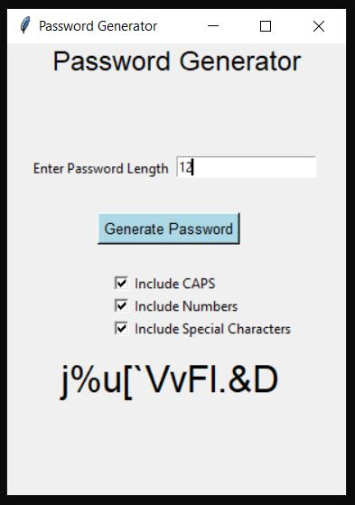
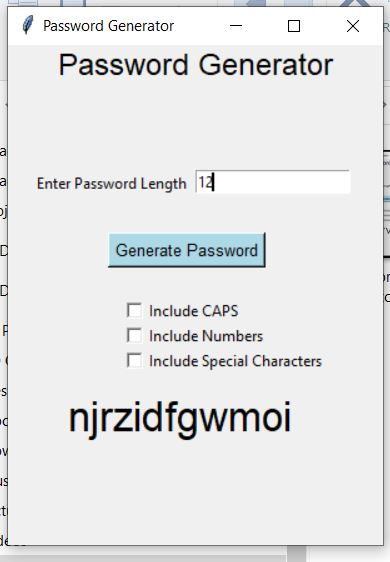
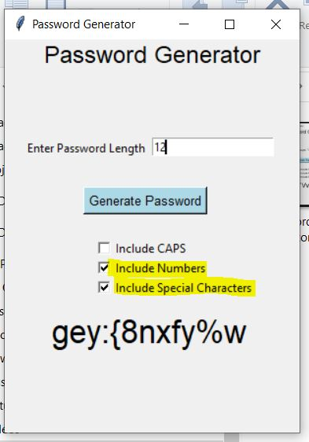
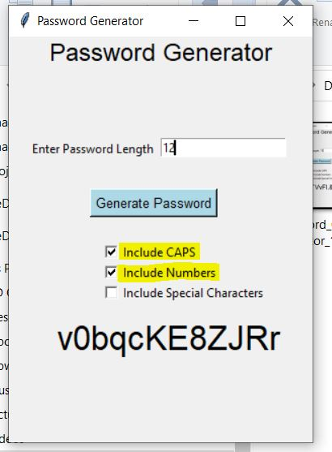

# Password Generator Project


1. Initiate and Activate the Virtual Enviroment.

```BASH
python3 -m venv venv && . venv/bin/activate 
```

2. Install requirements Modules

```PYTHON
pip install -r requirements.txt
```

3. Update `.flaskenv` as below:

```YAML
FLASK_APP=app
FLASK_DEBUG=True
```
-----

## To Run in CLI

```
python3 CLI_Password_Generator.py 
```

- Output:

```YAML
.../Project-Password-Generator$ python3 CLI_Password_Generator.py 
################################
    Password Generator Tool     
################################
Enter the Password Length: 14   
Do you need CAPS in the Password? (y/n): y
Do you need Numbers in the Password? (y/n): y
Do you need Special Characters in the Password? (y/n): y
The random password 1: ;GLw]*|]=?dP*%
The random password 2: wK.eed,U.(9NN\
The random password 3: T}-#~1F?ou9Kmn
The random password 4: :^o0,6t]EZ{Kx<
The random password 5: ._pGTZ!GKsU_C#
.../Project-Password-Generator$ 

.../Project-Password-Generator$ python3 CLI_Password_Generator.py 
################################
    Password Generator Tool     
################################
Enter the Password Length: 8    
Do you need CAPS in the Password? (y/n): y
Do you need Numbers in the Password? (y/n): y
Do you need Special Characters in the Password? (y/n): n
The random password 1: ior8Sds1
The random password 2: 3iNKdj1z
The random password 3: S9Mlc59v
The random password 4: YkOThCLQ
The random password 5: OoyxN9bS
.../Project-Password-Generator$

```


## To Run in GYI

- Open the path in Windows Explorer and double clik the file `GUI_Password_Generator`
- Then GUI Window will Open as below.
- Enter the Pawword Length and check the Required Boxes



----



----



----




