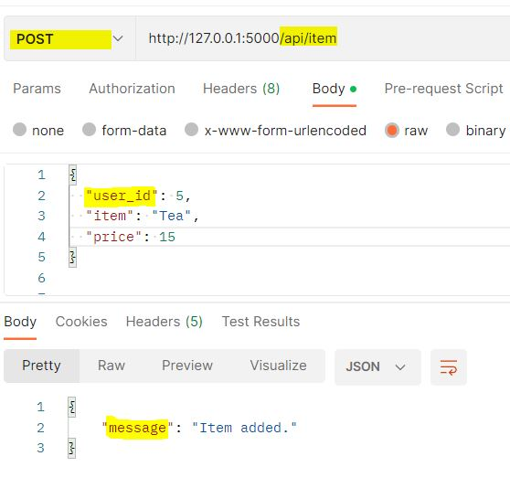

# Connect PostgreSQL through RESTAPI

PreRequisite:

Signup in: `https://www.elephantsql.com/` to use free PostgreSQL Server.

Install `Postman Tool` to POST and Get Queries

Steps:

1. Initiate and Activate the Virtual Enviroment.

```BASH
python3 -m venv venv && . venv/bin/activate 
```

2. Install requirements Modules

```PYTHON
pip install -r requirements.txt
```

3. Update `.flaskenv` as below:

```YAML
FLASK_APP=app
FLASK_DEBUG=True

```


5. Start the Application

```
flask run
```

6. Run Following POST Query in POSTMAN to create new user


7. Run Following POST Query in POSTMAN to add items in user



8. Login to `elephantsql` to verify the Entries in DataBase


9. To Chek the ITEMS Details:


