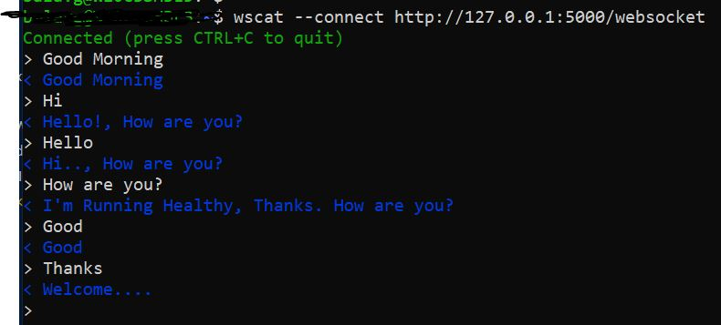

# WEB-SOCKET PROJECT

1. Initiate and Activate the Virtual Enviroment.

```BASH
python3 -m venv venv && . venv/bin/activate 
```

2. Install requirements Modules

```PYTHON
pip install -r requirements.txt
```

3. Update `.flaskenv` as below:

```YAML
FLASK_APP=app
FLASK_DEBUG=True

```

4. install `wscat` Package in your Machine 


5. Start the Application

```
flask run
```

6. Open New Terminal and Execute below command to connet the Application

```BASH
wscat --connect http://127.0.0.1:5000/websocket
```

7. Start Your Chating :) :)


