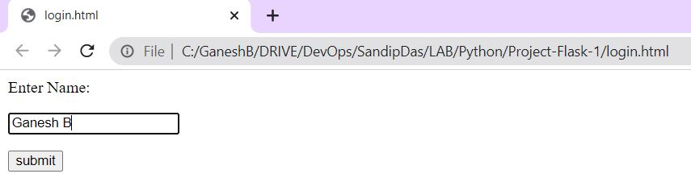

# Python-Examples

Uploading my recent PYTHON Script files here, Will keep updating, whenever facing new script challenges.

Details about the Scripts

---
### 1. request-module-git-api

[request-module-git-api.py](https://github.com/ganeshpondy/Python-Examples/blob/main/request-module-git-api.py)

Fetch multiple data from GitHub API via Request module, covert JSON data into a dictionary

#### Sample Output:

```PYTHON
python3 request-module-git-api.py

Project name is ganeshpondy/ansible-config-mgt 
Project URL is https://api.github.com/repos/ganeshpondy/ansible-config-mgt

Project name is ganeshpondy/aws-bootcamp-cruddur-2023
Project URL is https://api.github.com/repos/ganeshpondy/aws-bootcamp-cruddur-2023

Project name is ganeshpondy/Azure_DevOps_Pipeline
Project URL is https://api.github.com/repos/ganeshpondy/Azure_DevOps_Pipeline

```
---
### 2. Project-Flask-1

[Project-Flask-1](https://github.com/ganeshpondy/Python-Examples/blob/main/Project-Flask-1)

Create a Virtual Environment, then use Flask to show a web page with good looking API

Basically, when visiting the home page, it should read an HTML file in the filesystem and in response send that file's contents to the browser

#### Sample Output:

```BASH
python3 -m venv venv && . venv/bin/activate && pip install -r requirements.txt && python -c "import flask; print(flask.__version__)" || echo "Installation Error"
```

```BASH
Requirement already satisfied: zipp>=0.5 in ./venv/lib/python3.8/site-packages (from importlib-metadata>=3.6.0; python_version < "3.10"->Flask->-r requirements.txt (line 2)) (3.15.0)
2.2.3
(venv) :.../Project-Flask-1$ 
```
Run `python3 app_1.py` to start the WebServer

```BASH
(venv) user1@:.../Project-Flask-1$ python3 app_1.py 
 * Serving Flask app 'app_1'
 * Debug mode: on
WARNING: This is a development server. Do not use it in a production deployment. Use a production WSGI server instead.
 * Running on http://127.0.0.1:5000
Press CTRL+C to quit
 * Restarting with stat
 * Debugger is active!
 * Debugger PIN: 895-014-673
127.0.0.1 - - [04/Mar/2023 05:44:09] "POST /login HTTP/1.1" 302 -
127.0.0.1 - - [04/Mar/2023 05:44:09] "GET /success/Ganesh%20B HTTP/1.1" 200 -
127.0.0.1 - - [04/Mar/2023 05:44:09] "GET /favicon.ico HTTP/1.1" 404 -
```
Open the index.html file and Enter "Name" in the Text Box:



Then Press `submit` button.


Run `python3 app_2.py`

```BASH
(venv) user1@:.../Project-Flask-1$ python3 app_2.py 
 * Serving Flask app 'app_2'
 * Debug mode: on
WARNING: This is a development server. Do not use it in a production deployment. Use a production WSGI server instead.
 * Running on http://127.0.0.1:5000
Press CTRL+C to quit
 * Restarting with stat
 * Debugger is active!
 * Debugger PIN: 895-014-673
127.0.0.1 - - [04/Mar/2023 05:45:19] "GET / HTTP/1.1" 200 -
127.0.0.1 - - [04/Mar/2023 05:45:19] "GET /style.css HTTP/1.1" 404 -
```


---

### 3. Project-Flask-2-With-CSS

[Project-Flask-2-With-CSS](https://github.com/ganeshpondy/Python-Examples/blob/main/Project-Flask-2-With-CSS)

Create a Virtual Environment, then use Flask to show a web page with good looking API

Basically, when visiting the home page, it should read an HTML file in the filesystem and in response send that file's contents to the browser and with the CSS Style Updated.

#### Sample Output:

```BASH
python3 -m venv venv && . venv/bin/activate && pip install -r requirements.txt && python -c "import flask; print(flask.__version__)" || echo "Installation Error"
```
Run  `python3 app.py ` to start the WebServer

```BASH
(venv) user1@:.../Project-Flask-2-With-CSS$ python3 app.py 
 * Serving Flask app 'app'
 * Debug mode: on
WARNING: This is a development server. Do not use it in a production deployment. Use a production WSGI server instead.
 * Running on http://127.0.0.1:5000
Press CTRL+C to quit
 * Restarting with stat
 * Debugger is active!
 * Debugger PIN: 895-014-673
127.0.0.1 - - [04/Mar/2023 05:48:12] "GET / HTTP/1.1" 200 -
127.0.0.1 - - [04/Mar/2023 05:48:12] "GET /static/style.css HTTP/1.1" 200 -
```

Now the Page will open with the CSS Style.


